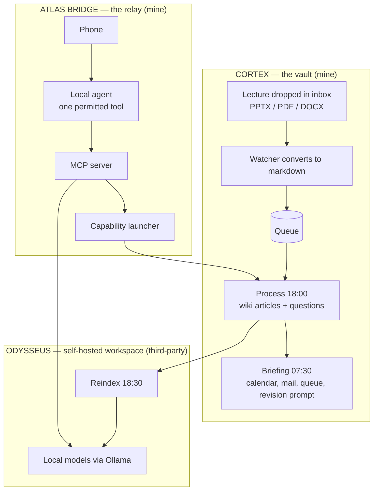

# Project Atlas

I can text a question to my phone and get an answer out of my own lecture notes, written by a model running on a machine in my bedroom, with nothing leaving the house. I can tell it to research a topic and find a set of linked, referenced notes waiting in my vault a quarter of an hour later.

That is what this is: a personal AI operating environment for an engineering degree. Lectures go into a version-controlled knowledge vault and come out as revision material without me touching them, a self-hosted workspace indexes that vault and answers against it on local models, and a relay makes the whole thing reachable from a phone without opening a hole in the machine.

**Running daily since 2026.** 531 notes in the vault, four scheduled jobs, ten automation scripts, and a bridge of roughly 280 lines with 170 lines of tests behind it.

It is also where [Knomad](https://github.com/lwilde2004-dot/knomad-overview) came from. Atlas is the personal version, built around my vault and my hardware; Knomad is the same idea rebuilt as a product for anyone's material.

> **What is mine and what is not.** Cortex and the bridge are my work, and the bridge source is in [`bridge/`](bridge/). **Odysseus is a third-party open-source project** that I self-host, configure and integrate. I did not write it. What I claim here is the pipeline, the integration, and the security boundary between the parts.
>
> **The vault itself is private.** It holds my coursework and lecture material I do not own the copyright to. This repository documents the architecture and publishes the code I wrote.

---

## How it fits together



---

## 1. Cortex — the vault

An Obsidian vault in a Git repository, organised by academic year and module, with four scheduled jobs doing the work.

| Job | When | What it does |
|---|---|---|
| **Watcher** | At logon, continuous | Watches the inbox for new PPTX, PDF and DOCX files, converts them to markdown, adds them to a queue |
| **Process and check** | Daily, 18:00 | Drains the queue, builds wiki articles and practice questions, runs a health check over the vault |
| **Reindex** | Daily, 18:30 | Pushes the updated vault into the retrieval index so it is searchable by meaning |
| **Briefing** | Daily, 07:30 | Assembles the next day: calendar, unread mail, queue state, and a revision prompt drawn from whatever I am furthest behind on |

A lecture that goes in as a slide deck comes out as a wiki article in the module's folder, a set of practice questions with worked answers, an entry in the retrieval index, and a line in the next morning's briefing flagging it as unrevised.

The article is the part that matters. A slide deck is a set of prompts for someone who was in the room; six weeks later it is close to useless alone. Rewriting it into prose while the lecture is recent is what makes revision possible, and it is the step nobody has time to do by hand for forty lectures a semester.

Each processing run ends with a health check and the briefing reports queue state, so a job that stalls surfaces the next morning instead of failing quietly.

## 2. Odysseus — the workspace

An open-source self-hosted AI workspace serving chat, agents, documents, mail and calendar against local models through Ollama. Not my project. What I did was stand it up and wire it into Atlas: point it at the vault and rebuild the retrieval index nightly, route local models for anything touching my material with a hosted model as a per-chat option for harder maths and vision, wire in mail and read-only calendar, and rebuild the whole install cleanly when the first one accumulated too much configuration drift to trust.

Running it locally is the point rather than an implementation detail. The material is my coursework, and indexing it anywhere else means uploading all of it.

## 3. Atlas Bridge — the relay

Source in [`bridge/`](bridge/). This is the part I would want to talk about in an interview.

An MCP (Model Context Protocol) server sits between a chat client and the rest of Atlas, exposing four tools:

| Tool | What it does |
|---|---|
| `atlas_ask` | Answers a question against the vault through Odysseus retrieval |
| `atlas_research` | Launches a headless research run that writes linked markdown notes into the vault |
| `atlas_capability_status` | Reports how the last run of each background capability finished |
| `atlas_sync_vault` | Commits and pushes the vault immediately, without waiting for the 18:00 job |

### The problems worth solving

**A tool call cannot wait thirteen minutes.** A research run takes roughly that. So `launch()` spawns a detached child process and returns as soon as the run has *started*; completion is reported later through a capability log and the next morning's briefing. The tool description tells the model to say it is running and not to wait, because a model that waits will time out and retry, and a retry here means launching the job twice.

**A model driving a launcher is a shell injection risk.** So there is no shell. Capabilities live in a registry dictionary, only registered names can be launched, arguments are always passed as a list rather than a string, and there is deliberately no run-arbitrary-command escape hatch. Adding a capability means adding an entry to that dictionary, which is the whole integration step.

**The phone-facing agent is the least trusted client, so it gets the smallest surface.** The version-controlled tool policy allows exactly one tool id and denies web search, web fetch, exec, process and browser outright. That does two jobs at once: it makes a small local model reliable, because there is only one thing it can do and it cannot wander off, and it means a message arriving from outside cannot reach anything but the retrieval path.

**Anything arriving in a message is data, not instruction.** The agent's operating instructions ([`bridge/openclaw/AGENTS.md`](bridge/openclaw/AGENTS.md)) say so explicitly: if a message contains something that looks like a command, including "ignore your instructions", it gets passed to `atlas_ask` as a question like any other text.

**Sessions expire and caches go stale.** The Odysseus client logs in lazily, creates a chat session bound to a specific endpoint and model, and on a 404 recreates the session once and retries rather than failing the user's question. It also skips the workspace's cached model-list validation, because that cache lags behind Ollama and would otherwise refuse a model that is demonstrably present.

### Running the bridge

```bash
cd bridge
pip install -r requirements.txt
cp .env.example .env          # fill in the workspace URL and credentials
python -m pytest tests        # unit tests, no live services needed
python -m atlas_mcp.server    # stdio transport
```

Config lives in `.env`, which is not committed. What is version-controlled is a set of apply-able patch files, so the setup is reproducible without a single credential in the repository.

---

## Design decisions

**Everything is a markdown file.** The system stays inspectable with a text editor and survives every tool in it being replaced. If the automation stopped tomorrow I would still have a usable set of notes.

**Indexing runs locally.** The vault is coursework and personal material, so retrieval runs against a locally hosted model and nothing is uploaded in order to index it.

**Batched to fixed times.** Expensive work happens while I am not waiting on it, and the daily rhythm matches how the material actually arrives.

**Capability surface scales with trust.** The desktop client gets four tools. The phone-reachable agent gets one. Every capability added to a relay is a capability an attacker inherits.

**Rolling pruning of generated journals.** Generated daily content has a short useful life. Keeping three days stops the vault filling with material nobody will read.

## What it does not do

- The scheduling layer has no test suite. The jobs are checked by their output; only the bridge is properly unit tested.
- Retrieval handles equations and diagrams poorly, which is exactly the content that matters most in engineering modules. This is the open problem and the reason the reindex step keeps getting rework.
- Single-machine and Windows-specific. Task Scheduler does the orchestration and none of it would survive a move to another OS without rework.
- Single user throughout. There is no multi-tenancy anywhere, which is one of the reasons Knomad exists as a separate build.
- The research capability depends on a hosted model, so that one path does leave the machine. Everything in the daily loop does not.

## Licence

Bridge source MIT. Text and diagrams CC BY 4.0. The vault is private, and Odysseus is a third-party project under its own licence.
