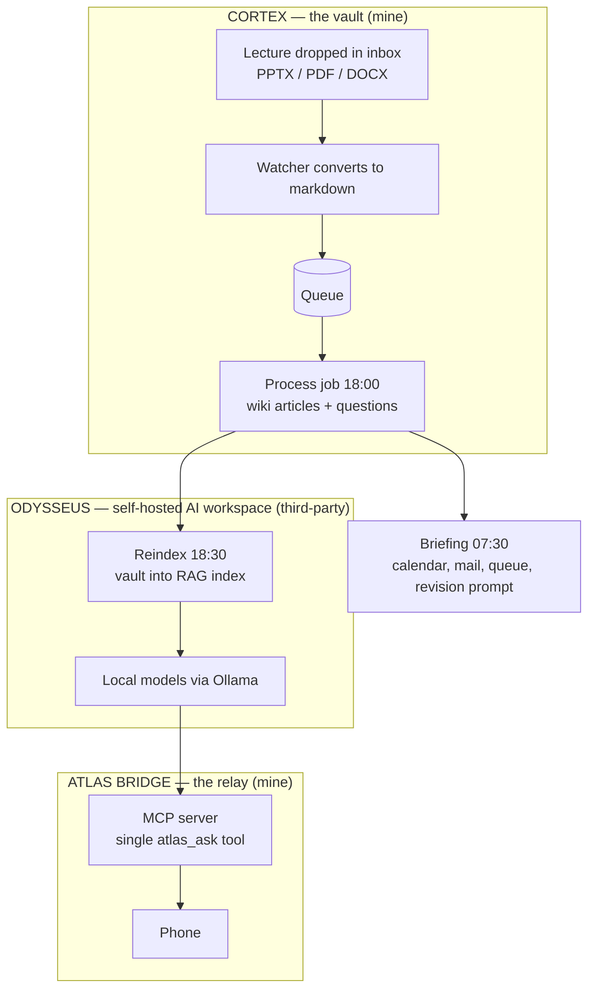

# Project Atlas

A personal AI operating environment for an engineering degree. Lectures go into a version-controlled knowledge vault and come out as revision material without me touching them; a self-hosted AI workspace indexes that vault and answers questions against it using models running on my own hardware; and a relay lets me query the whole thing from my phone.

Running daily on my own machine. It is what [Knomad](https://github.com/lwilde2004-dot/knomad-overview) grew out of: Atlas is the personal version built around my vault and my machine, Knomad is the same idea rebuilt as a product for anyone's material.

**What is mine and what is not.** Cortex and the bridge are my work. **Odysseus is a third-party open-source project** that I self-host, configure and integrate; I did not write it. The engineering I claim here is the pipeline, the integration and the security boundary between the parts.

**The vault itself is private.** It holds my coursework, my notes and lecture material I do not own the copyright to, none of which belongs on GitHub. This repository documents the architecture.

---

## The three parts

---

## 1. Cortex — the knowledge vault

An Obsidian vault in a Git repository, organised by academic year and module, with four scheduled jobs doing the work.

| Job | When | What it does |
|---|---|---|
| **Watcher** | At logon, continuous | Watches the inbox for new PPTX, PDF and DOCX files, converts them to markdown, adds them to a processing queue |
| **Process and check** | Daily, 18:00 | Drains the queue, builds wiki articles and practice questions from the converted text, runs a health check over the vault |
| **Reindex** | Daily, 18:30 | Pushes the updated vault into the retrieval index so it is searchable by meaning |
| **Briefing** | Daily, 07:30 | Assembles the next day: calendar, unread mail, inbox and queue state, and a revision prompt drawn from whatever I am furthest behind on |

Each processing run ends with a health check, and the morning briefing reports inbox and queue state, so a job that stalls shows up the next morning instead of failing quietly.

### What comes out of it

A lecture that goes in as a slide deck comes out as, in the vault:

- a **wiki article** in the module's folder, written in full sentences and cross-linked to related topics
- a set of **practice questions** with worked answers, since recognition is not recall
- an entry in the **retrieval index**, so the material is searchable by meaning rather than filename
- a line in the next **morning briefing**, flagging it as new and unrevised

The article is the part that matters. A slide deck is a set of prompts for a person who was in the room; six weeks later it is close to useless on its own. Rewriting it into prose while the lecture is recent is the step that makes revision possible at all, and it is the step nobody has time to do by hand for every lecture.

---

## 2. Odysseus — the AI workspace

An open-source self-hosted workspace that runs locally and serves chat, agents, documents, email and calendar against local models through Ollama. **Not my project.** What I did was stand it up and wire it into Atlas:

- **Vault indexing.** Point it at the Cortex vault and rebuild the retrieval index nightly, so questions are answered from my own notes rather than from whatever the model happens to remember.
- **Model routing.** Local models for anything touching my material; a hosted model configured as a per-chat option for the harder maths and vision work, where the local model is not good enough.
- **Integrations.** Mail wired in, calendar read-only.
- **Recommissioning.** The current install is a clean rebuild after the first one accumulated too much configuration drift to trust. The old one is kept, not deleted, until the new one has proven itself.

Running it locally is the point, not an implementation detail: the material is my coursework, and indexing it on someone else's hardware would mean uploading all of it.

---

## 3. Atlas Bridge — the relay

The part I am most pleased with. It lets me ask my vault a question from my phone, and it does that without opening a hole in the machine.

A local agent runs on a small model through Ollama, and a **Model Context Protocol server exposes exactly one tool**, `atlas_ask`, which takes a question and returns an answer grounded in the vault via Odysseus retrieval.

The design decision worth explaining is the allow-list. The agent's tool policy permits `atlas_ask` and nothing else. **No shell, no filesystem, no web.** That does two things at once: it makes a small local model reliable, because there is only one thing it can do and it cannot wander, and it means a prompt injected into a message cannot reach anything outside the retrieval path. A relay that could run shell commands on my machine would be a bad idea no matter how well it worked.

Config lives outside the repository; what is version-controlled is a set of apply-able patches, so the setup is reproducible without any credential being committed.

---

## Design decisions

**Everything is a markdown file.** The whole system stays inspectable with a text editor and survives every tool in it being replaced. If the automation stopped tomorrow I would still have a usable set of notes.

**Indexing runs locally.** The vault is coursework and personal material. Retrieval runs against a locally hosted model so nothing is uploaded in order to index it.

**Batched to fixed times.** The expensive work happens while I am not waiting on it, and the daily rhythm matches how the material actually arrives.

**One tool, not many.** The bridge's capability surface is deliberately one function wide. Every capability added to a relay is a capability an attacker inherits.

**Rolling pruning of generated journals.** Generated daily content has a short useful life. Keeping three days and deleting the rest stops the vault filling with material nobody will read.

---

## What it does not do

- No tests worth the name around the scheduling layer. The jobs are checked by their output, not by a suite.
- The retrieval index handles equations and diagrams poorly, which is exactly the content that matters most in engineering modules. This is the open problem.
- It is single-machine and Windows-specific. Task Scheduler is doing the orchestration, and none of it would survive a move to another OS without rework.
- Everything assumes one user, me. There is no multi-tenancy anywhere, which is one of the reasons Knomad exists as a separate build.

## Licence

Text and diagrams CC BY 4.0. The vault itself is private. Odysseus is a third-party open-source project under its own licence.
