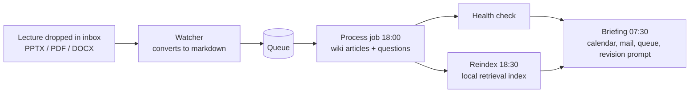

# Cortex — automated study pipeline

A personal knowledge system that turns raw lecture files into structured revision material without me touching them. Drop a lecture into an inbox folder; by the evening it is converted, filed, written up and indexed, and the next morning it appears in a briefing alongside what I actually need to do that day.

Running daily on my own machine, and it is what [Knomad](https://github.com/lwilde2004-dot/knomad-overview) grew out of: Cortex is the personal version over my own vault, Knomad is the same idea rebuilt as a product for anyone's material.

**This repository documents the architecture. The vault itself is private** — it holds my coursework, my notes and lecture material I do not own the copyright to, none of which belongs on GitHub.

---

## The problem

Engineering modules produce a large volume of slides, notes and problem sheets, in formats that resist revision. Reading a PowerPoint is not studying. Converting each one by hand into something useful takes longer than the lecture did, so in practice it does not get done.

## How it works

Four scheduled jobs, each doing one thing:

| Job | When | What it does |
|---|---|---|
| **Watcher** | At logon, continuous | Watches the inbox for new PPTX, PDF and DOCX files, converts them to markdown, and adds them to a processing queue |
| **Process and check** | Daily, 18:00 | Drains the queue, builds wiki articles and practice questions from the converted text, then runs a health check over the vault |
| **Reindex** | Daily, 18:30 | Pushes the updated vault into a local retrieval index so it can be searched semantically |
| **Briefing** | Daily, 07:30 | Assembles the next day: calendar, unread mail, inbox and queue state, and a revision prompt drawn from the material I am furthest behind on |

Each processing run ends with a health check over the vault, and the morning briefing reports inbox and queue state, so a job that stalls shows up the next morning instead of failing quietly.

## Pipeline

## Structure

The vault is organised by academic year and module, each module holding raw source material, the generated wiki, and outputs (flashcards, practice questions). Journal entries are dated and pruned on a rolling window so the folder does not grow without limit. Everything is a plain markdown file in a Git repository, so the whole thing is greppable, diffable and recoverable.

## Stack

Python for conversion, queue processing and briefing generation. PowerShell for the scheduled task wrappers. Windows Task Scheduler for orchestration. Ollama running a local model for indexing and retrieval, so the material never leaves the machine. Git for version control and history.

## What comes out of it

A lecture that goes in as a slide deck comes out as, in the vault:

- a **wiki article** in the module's folder, written in full sentences and cross-linked to related topics
- a set of **practice questions** with worked answers, since recognition is not recall
- an entry in the **retrieval index**, so the material is searchable by meaning rather than filename
- a line in the next **morning briefing**, flagging it as new and unrevised

The article is the part that matters. A slide deck is a set of prompts for a person who was in the room; six weeks later it is close to useless on its own. Rewriting it into prose while the lecture is recent is the step that makes revision possible at all, and it is the step nobody has time to do by hand for every lecture.

## Why it is built this way

**Everything is a markdown file.** The whole system stays inspectable with a text editor and survives every tool in it being replaced. If the automation stopped tomorrow, I would still have a usable set of notes.

**Indexing runs locally.** The vault is coursework and personal material. Retrieval runs against a locally hosted model so nothing is uploaded to index it.

**Batched to fixed times.** Batching to fixed times means the expensive work happens while I am not waiting on it, and the daily rhythm matches how the material actually arrives.

**Rolling pruning of generated journals.** Generated daily content has a short useful life. Keeping three days and deleting the rest stops the vault filling with material nobody will read.

## Status

All four jobs running. Ongoing work is on the retrieval side — improving how the index handles equations and diagrams, which is where converted engineering slides degrade most.

## Licence

Text and diagrams CC BY 4.0. The vault itself is private.
